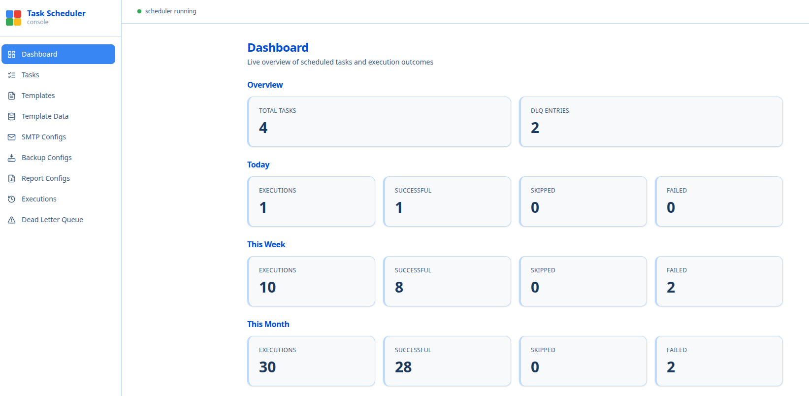
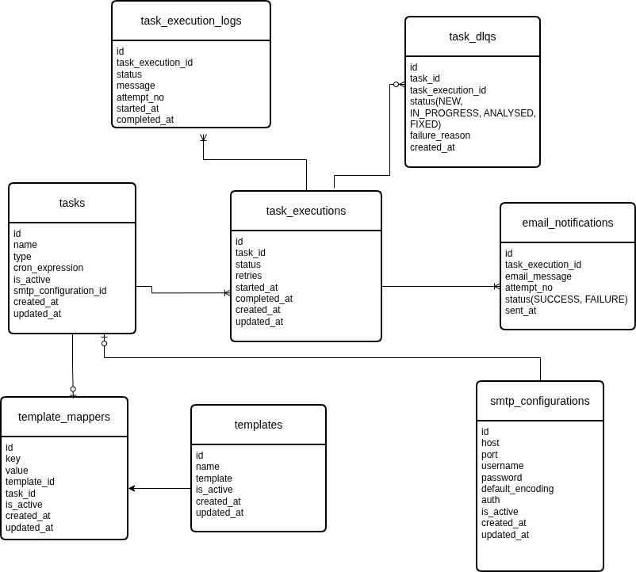

# Task Scheduler

A task scheduling system built with Java, Spring Boot, and React. It runs recurring jobs on a cron schedule, retries them when they fail, and records every attempt so that a failure can be diagnosed after the fact rather than guessed at.

It supports three task types: **email notifications**, **database backups**, and **report generation**.



*Live overview of scheduled tasks and execution outcomes — task and dead-letter
totals up top, then execution results (successful, skipped, failed) broken out
for today, this week, and this month.*

---

## Contents

- [What it does](#what-it-does)
- [Task types](#task-types)
- [Architecture](#architecture)
- [How scheduling works](#how-scheduling-works)
- [Failure handling](#failure-handling)
- [Data model](#data-model)
- [Tech stack](#tech-stack)
- [Getting started](#getting-started)
- [Configuration](#configuration)
- [API reference](#api-reference)
- [Project structure](#project-structure)
- [Known limitations](#known-limitations)

---

## What it does

- Create tasks that run on a cron schedule, and activate or deactivate them without deleting them
- Dispatch each task to a handler chosen by task type, on a bounded thread pool
- Retry a failed task up to three times, then park it in a dead letter queue instead of losing it
- Record every attempt — status, exit code, command output, timestamps — against the execution that produced it
- Compose emails from reusable templates with per-task placeholder data
- Export the dead letter queue to XLSX over a date range, for triage outside the app
- Surface task, execution, and DLQ counts on a dashboard, with execution outcomes (successful, skipped, failed) broken out for today, this week, and this month

---

## Task types

| Type | What it does | Configured by |
|---|---|---|
| `EMAIL_NOTIFICATION` | Renders a template, resolves recipients, sends over SMTP. Optionally attaches a file. | `smtp_configurations` + `templates` + `task_template_data` |
| `DATABASE_BACKUP` | Shells out to a backup command, enforces a timeout, records the exit code and output. | `backup_configurations` |
| `REPORT_GENERATION` | Shells out to a report command, then verifies the expected output file was actually produced. | `report_generation_configurations` |

Adding a fourth means implementing `TaskHandler` and registering it — `TaskHandlerRegistry` dispatches on the enum, so nothing else changes.

---

## Architecture



The system has **two independent entry points** that meet only at the database:

- **The request path** — the React UI calls the REST API through a JWT filter, into controllers, services, and JPA repositories.
- **The execution path** — a `@Scheduled` poller finds due tasks and puts them on a queue. A second `@Scheduled` drain pulls them off and submits them to a thread pool. Nothing about this path is triggered by an HTTP request.

This distinction matters: creating a task through the API doesn't run it. The scheduler picks it up on its next poll.

Handlers reach outside the JVM in three ways — SMTP for email, an OS process (`sh -c`) for backup and report commands, and the filesystem for report output and email attachments. Those are the three places the system can fail for reasons that have nothing to do with its own code, which is why command output and file checks are persisted rather than discarded.

---

## How scheduling works

Each task carries a cron expression and a `next_execution_time` — the single source of truth for when it is next due. The poller asks one question:

```sql
WHERE is_active = true AND (next_execution_time IS NULL OR next_execution_time <= :now)
```

A task that has never been scheduled has no `next_execution_time`. The poller initialises it from the cron expression and leaves it there; it runs on the following poll, not immediately. A task that is due is queued and its `next_execution_time` advanced to the next cron fire time — both in the same transaction, so a crash between the two can't queue the same slot twice.

Because the due check compares against a persisted timestamp rather than re-evaluating the cron expression against a time window, the result doesn't depend on how often the poller runs. Changing the polling interval changes latency, not which tasks fire. The check also stays flat as execution history grows, since it reads a column on `tasks` rather than scanning past executions.

Schedules resolve on create and update, so editing a task's cron expression takes effect on the next poll without a restart.

Queue capacity is bounded (`app.scheduler.queue-capacity`, default 500) and the queue rejects a task already waiting in it, so a slow handler causes a backlog rather than unbounded memory growth.

---

## Failure handling

A handler signals failure by throwing. The executor then:

1. Writes the attempt to `task_execution_logs` with the failure message
2. Parks the task in an in-memory retry queue with a due time, up to `max-retries` (default 3), and frees the pool thread immediately
3. On exhaustion, marks the execution `FAILED` and writes a row to `task_dlq` with status `NEW`

A run keeps one `task_executions` row across all its attempts, staying `IN_PROGRESS` until it either succeeds or exhausts its retries. Every attempt — successful or not — is written to `task_execution_logs` with its `attempt_no`. So a task that fails twice and succeeds on the third try reads as one completed run with three attempts behind it, rather than three separate runs.

**Retries don't hold a thread.** A failed attempt isn't slept off on the worker that ran it — it's parked in an in-memory retry queue stamped with a due time, and the worker returns to the pool at once. A light sweep (every `retry-queue-poll-ms`, default 1s) moves due retries back onto the main queue, so the delay is enforced by a timestamp rather than by pinning a thread; a long delay across many failing tasks can no longer starve the pool. A retry that would land on top of the task's next scheduled run — because retries dragged past it, or because a fresh run is already in flight — is dropped and its execution marked `SKIPPED`, with both the intended retry time and the scheduled time recorded in `task_execution_logs`. The task just carries on with its schedule rather than running twice.

**Interrupted runs resume after a restart.** The retry queue is in-memory, so a crash loses it; on startup it is rebuilt from the execution rows the previous process left behind. An `IN_PROGRESS` row, or a `FAILED` row with retries left, advances to its next attempt — for an interrupted `IN_PROGRESS` run the crash counts as a consumed retry, so a run that only ever crashes eventually exhausts its budget and is dead-lettered on restart instead of tying up a thread forever. `IN_PROGRESS` retries are due immediately; `FAILED` retries wait out the remaining delay; either is `SKIPPED` instead if its next scheduled run has already come round. A `FAILED` row whose retries are spent is already in the DLQ, so it is left alone.

Because each scheduled occurrence records its own execution row, a task can leave several recoverable rows behind after repeated restarts. They are grouped by task and only the newest resumes; the older ones are superseded and marked `SKIPPED`, their log naming the row that replaced them — so a pile-up of stale rows resolves once on the first startup rather than fanning out into duplicate retries that reappear on every boot.

The DLQ is reviewable in the UI, movable through `NEW → IN_PROGRESS → ANALYSED → FIXED`, and exportable to XLSX by date range.

**Failure messages carry the cause.** Shell-based handlers append the tail of the command's combined stdout/stderr (bounded to 1500 chars) to the exception message, so `task_dlq.failure_reason` says *"exited with code 1 | output: /opt/reports: Permission denied"* rather than just *"exited with code 1"*. The report handler additionally fails when the command exits `0` but the expected output file isn't there — a silent success is still a failure.

Timeouts are enforced by draining the process's output on a separate thread while the main thread waits, then calling `destroyForcibly()`. Reading the stream to EOF first would block until the process exits on its own, which makes the timeout unreachable exactly when it's needed.

---

## Data model



Twelve tables across four groups:

- **Configuration** — `smtp_configurations`, `backup_configurations`, `report_generation_configurations`, `templates`
- **Core** — `tasks`, `task_template_data`, `task_executions`
- **Per-attempt records** — `task_execution_logs`, `email_notifications`, `backup_executions`, `report_generation_executions`
- **Failure** — `task_dlq`

A `task` points at exactly one configuration, matching its type. Each run creates one `task_execution`, whatever its outcome. Each attempt within that run adds a `task_execution_log`, and — for the shell-based types — a type-specific record holding what actually happened: the command, the exit code, the output.

Schema is managed by Flyway with `ddl-auto: validate`, so an entity that drifts from the schema fails at startup rather than at runtime.

---

## Tech stack

**Backend** — Java 25, Spring Boot 4.0.6, Spring Security (JWT via jjwt), Spring Data JPA, Flyway, Apache POI (XLSX export), springdoc-openapi, Maven

**Frontend** — React 19, Vite 6, React Router 7, Tailwind CSS 4, Axios, lucide-react

**Database** — MySQL 8

---

## Getting started

### With Docker

```bash
git clone <repo-url>
cd task-scheduler
docker compose up --build
```

That one command builds and starts everything — no JDK, Node, or MySQL on your host. Compose brings up MySQL, waits for it to pass a healthcheck, then starts the backend (which runs its Flyway migrations on boot) and serves the UI behind Apache.

| | |
|---|---|
| UI | http://localhost:5173 |
| API | http://localhost:8080/api/v1 |
| Swagger | http://localhost:8080/swagger-ui.html |
| MySQL | `localhost:3307` (3307 to avoid clashing with a local install) |
| Login | `admin` / `admin123` |

The first build takes a few minutes while Maven resolves the dependency tree; after that it's cached unless `pom.xml` changes. `docker compose down` stops everything and keeps your data — add `-v` to drop the database, reports, and backups too.

Copy `.env.example` to `.env` to override credentials. Every value has a working default, so it isn't required to get started.

### Without Docker

**Prerequisites:** JDK 25, Maven 3.9+, Node 20+, MySQL 8

```sql
CREATE DATABASE task_scheduler;
```

```bash
cd backend && mvn clean package && mvn spring-boot:run   # :8080
cd ui && npm install && npm run dev                      # :5173
```

Flyway creates the schema on first boot — no manual DDL.

Then deploy the task scripts, which the backup and report task types shell out to:

```bash
sudo install -m 755 scripts/backup.sh /opt/scripts/backup.sh
sudo install -m 755 scripts/dlq_report.sh /opt/scripts/dlq_report.sh
sudo mkdir -p /opt/reports && sudo chown <backend-user> /opt/reports
```

That last line matters. The scripts run as whatever user the JVM runs as, not as you — a directory you can write to is not necessarily one the service can write to. The Docker image handles this by building the directories and running as a non-root `scheduler` user.

---

## Configuration

Every value below is overridable by environment variable.

| Variable | Default | Purpose |
|---|---|---|
| `SCHEDULER_POLLING_INTERVAL_MS` | `10000` | How often to look for due tasks |
| `SCHEDULER_MAX_RETRIES` | `3` | Attempts before the DLQ |
| `SCHEDULER_RETRY_DELAY_MS` | `5000` | Delay before a failed attempt is retried |
| `SCHEDULER_RETRY_QUEUE_POLL_MS` | `1000` | How often the retry queue is swept for due retries |
| `THREAD_POOL_CORE_SIZE` | `5` | Executor core threads |
| `THREAD_POOL_MAX_SIZE` | `10` | Executor max threads |
| `THREAD_POOL_QUEUE_CAPACITY` | `100` | Executor's internal queue |
| `JWT_SECRET` | *(dev value)* | HMAC signing key |
| `JWT_EXPIRATION_MS` | `86400000` | Token lifetime (24h) |
| `ADMIN_USERNAME` / `ADMIN_PASSWORD` | `admin` / `admin123` | The single application user |

> **Before deploying anywhere real:** override `JWT_SECRET`, `ADMIN_PASSWORD`, and the datasource credentials. The committed defaults are development values and are not secret.

SMTP is configured at runtime through the UI, not in `application.yaml` — credentials live in `smtp_configurations`.

---

## API reference

All routes are under `/api/v1`. Everything except `/auth/login` needs an `Authorization: Bearer <token>` header. Interactive docs are at `/swagger-ui.html` when the backend is running.

### The CRUD convention

`/tasks`, `/templates`, `/smtp-configurations`, `/backup-configurations`, and `/report-configurations` all follow the same shape:

| Method | Path | Purpose |
|---|---|---|
| `POST` | `/` | Create |
| `GET` | `/` | List all |
| `GET` | `/{id}` | Fetch one |
| `PUT` | `/{id}` | Update |
| `PATCH` | `/{id}/deactivate` | Soft-delete — flips `is_active` off |

Nothing is hard-deleted. Execution history references its configuration, so removing a row would strand the audit trail; deactivating hides it from the UI and stops the scheduler picking it up while leaving past executions readable.

A task points at its configuration by foreign key, so a handler reads the configuration off the task it was given. There's no notion of a globally "active" configuration to resolve against.

### Everything else

| Method | Path | Purpose |
|---|---|---|
| `POST` | `/auth/login` | Exchange username and password for a JWT |
| `GET` | `/analytics` | Dashboard counts — tasks, executions, emails, DLQ entries |
| `GET` | `/task-executions` | Every run, most recent first |
| `GET` | `/task-executions/{id}` | One run |
| `GET` | `/task-executions/task/{taskId}` | Run history for a single task |
| `GET` | `/task-executions/status/{status}` | Filter runs by status |
| `GET` | `/task-dlq` | Tasks that exhausted their retries |
| `GET` | `/task-dlq/{id}` | One DLQ entry, with its failure reason |
| `GET` | `/task-dlq/status/{status}` | Filter by triage status |
| `PATCH` | `/task-dlq/{id}/status` | Move an entry through `NEW → IN_PROGRESS → ANALYSED → FIXED` |
| `GET` | `/task-dlq/export` | Download failures as XLSX |
| `POST` | `/task-template-data` | Bind placeholder values to a task |
| `GET` | `/task-template-data/task/{taskId}` | Placeholder values for a task |
| `PUT` | `/task-template-data/{id}` | Update a binding |
| `DELETE` | `/task-template-data/{id}` | Remove a binding — the one genuine delete in the API |

Task executions are read-only over HTTP. They're written by the scheduler, and nothing outside it should be inventing execution history.

`/task-dlq/export` takes either `dateRange` (`TODAY`, `YESTERDAY`, `PAST_7_DAYS`, `PAST_30_DAYS`) or `from` + `to`, plus an optional `status`, and streams back an XLSX.

---

## Project structure

```
backend/src/main/java/com/taskscheduler/
├── config/          Thread pool, security, password encoder
├── controller/      REST endpoints
├── dto/             Request and response models
├── entity/          JPA entities
├── enums/           TaskType, TaskStatus, DlqStatus, ...
├── exception/       GlobalExceptionHandler
├── repository/      Spring Data repositories
├── scheduler/
│   ├── handler/     TaskHandler + one per task type, TaskHandlerRegistry
│   ├── TaskSchedulerEngine.java    finds due tasks, queues them
│   ├── TaskExecutorEngine.java     drains the queue, runs tasks, parks retries, DLQ
│   ├── RetryQueueEngine.java       sweeps due retries, rebuilds them on startup
│   ├── RetryQueue.java             in-memory retry holding queue
│   ├── RetryEntry.java             one pending retry
│   └── BoundedPriorityTaskQueue.java
├── security/        JWT filter, token provider, user details
└── service/         Business logic

backend/src/main/resources/db/migration/   Flyway migrations
backend/Dockerfile                         JDK build stage -> JRE runtime
ui/src/{pages,components,api,context}/     React app
ui/Dockerfile                              Vite build -> Apache
ui/apache.conf                             SPA fallback + /api/v1 proxy
scripts/                                   backup.sh, dlq_report.sh
docker-compose.yml                         mysql + backend + ui
```

---

## Known limitations

Stated deliberately — these are known, not overlooked.

- **Single user.** Credentials come from configuration via `CustomUserDetailsService`; there is no `users` table and no registration. Adding one is a schema change and a service, not a redesign.
- **Single instance.** Active executions are tracked in an in-memory map, so they're lost on restart and two instances would both queue the same task. Going multi-instance needs the claim to be atomic — a conditional update on `tasks`, `SELECT ... FOR UPDATE SKIP LOCKED`, or a distributed lock such as ShedLock — and the in-memory state moved somewhere shared.
